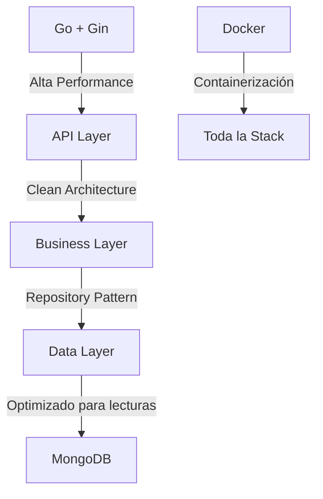
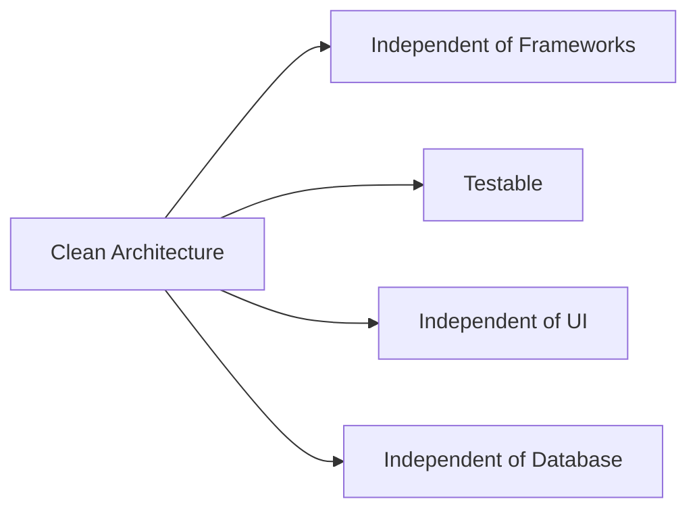
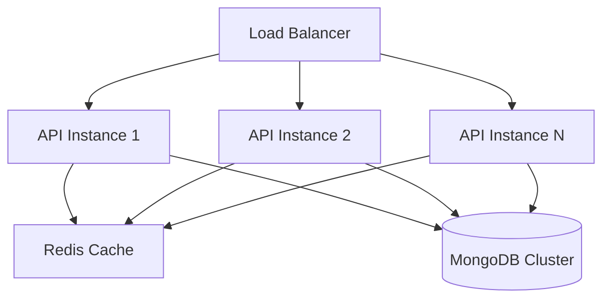
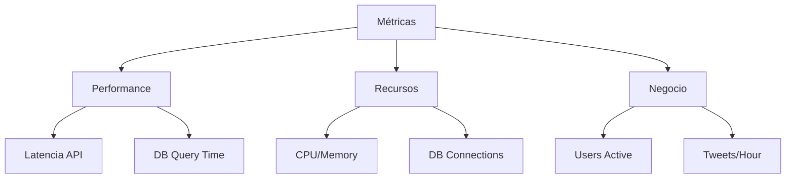
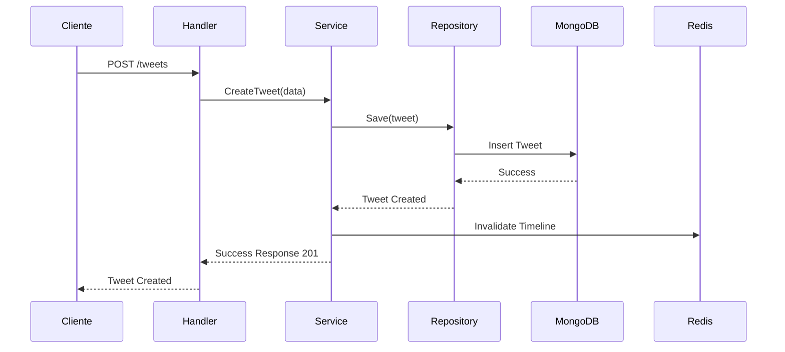
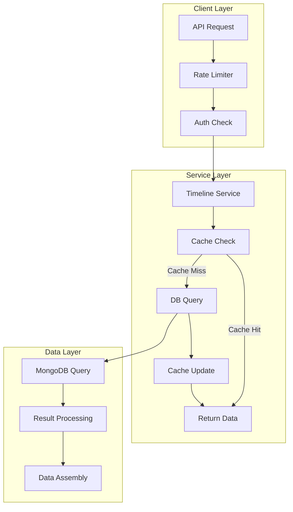
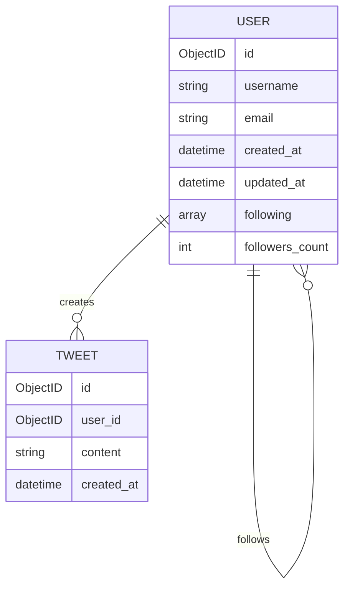
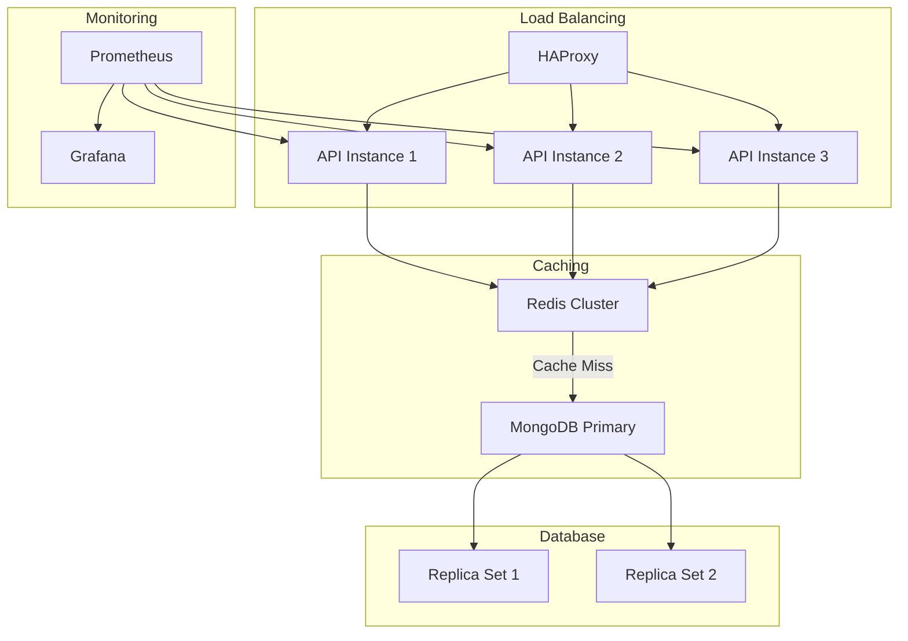
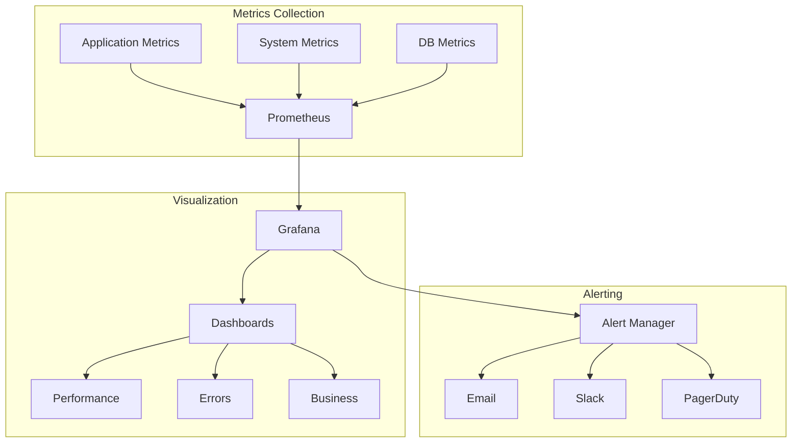

# Microblog Platform - Arquitectura

## Visión General
Plataforma de microblogging diseñada para manejar millones de usuarios, permitiendo publicar mensajes cortos, seguir a otros usuarios y ver un timeline personalizado.

## Decisiones Arquitectónicas

### 1. Elección de Tecnologías


#### Go + Gin Framework
- **¿Por qué Go?**
  - Alto rendimiento y baja latencia
  - Excelente manejo de concurrencia
  - Compilación a binario único
  - Tipado estático para robustez

- **¿Por qué Gin?**
  - Rendimiento superior vs otros frameworks
  - Middleware ecosystem robusto
  - Manejo eficiente de rutas
  - Baja curva de aprendizaje

#### MongoDB
- **¿Por qué NoSQL?**
  - Esquema flexible para evolución
  - Mejor performance en lecturas
  - Escalabilidad horizontal natural
  - Manejo eficiente de datos JSON

### 2. Patrones de Diseño


#### Clean Architecture
- **Capas**
  ```
  ├── Entities (Models)
  │   └── Reglas de negocio independientes
  ├── Use Cases (Services)
  │   └── Reglas de aplicación específicas
  ├── Interface Adapters (Repositories)
  │   └── Conversión de datos
  └── Frameworks & Drivers
      └── Detalles técnicos externos
  ```

#### Repository Pattern
- Abstracción de acceso a datos
- Facilita testing con mocks
- Permite cambiar implementación de DB

## Estrategia de Escalabilidad

### 1. Escalabilidad Horizontal


#### Componentes Clave
- **Load Balancer**: Distribución de carga
- **Multiple API Instances**: Escalado horizontal
- **MongoDB Sharding**: Particionamiento de datos
- **Redis Cache**: Caché de lecturas frecuentes

### 2. Optimizaciones de Rendimiento

#### Base de Datos
```javascript
// Índices MongoDB
db.tweets.createIndex({"user_id": 1, "created_at": -1})
db.users.createIndex({"username": 1}, {unique: true})
db.users.createIndex({"email": 1}, {unique: true})
```

#### Caché
```go
// Estrategia de caché
type CacheStrategy struct {
    Timeline    time.Duration // 5 minutos
    UserProfile time.Duration // 15 minutos
    TweetCount  time.Duration // 1 minuto
}
```

## Configuración y Despliegue

### Docker Compose
```yaml
version: "3.8"
services:
  api:
    build: .
    ports:
      - "8080:8080"
    depends_on:
      - mongodb
      - redis
    environment:
      - MONGODB_URI=mongodb://mongodb:27017
      - REDIS_URI=redis://redis:6379

  mongodb:
    image: mongo:latest
    ports:
      - "27017:27017"
    volumes:
      - mongodb_data:/data/db

  redis:
    image: redis:alpine
    ports:
      - "6379:6379"
```

### Kubernetes (Preparado para futuro)
```yaml
# Ejemplo de configuración básica
apiVersion: apps/v1
kind: Deployment
metadata:
  name: microblog-api
spec:
  replicas: 3
  selector:
    matchLabels:
      app: microblog-api
```

## Monitoreo y Logging

### Métricas Clave


## Tests y Calidad

### Cobertura Actual
- Unit Tests: 80.3%
- Integration Tests: Implementados
- Performance Tests: Preparados

### Estrategia de Testing
```go
// Ejemplo de test architecture
func TestUserService_Create(t *testing.T) {
    // Given
    mockRepo := NewMockRepository()
    service := NewUserService(mockRepo)
    
    // When
    user, err := service.Create(...)
    
    // Then
    assert.NoError(t, err)
}
```

# Diagramas y Ejemplos Adicionales

## 1. Flujo de Datos Detallado



## 2. Arquitectura de Timeline



## 3. Estructura de Datos


## 4. Ejemplos de Implementación

### Ejemplo de Rate Limiting
```go
// middleware/rate_limit.go
func RateLimitMiddleware() gin.HandlerFunc {
    store := redis.NewClient(&redis.Options{
        Addr: "localhost:6379",
    })
    
    return func(c *gin.Context) {
        // Obtener IP o user ID
        key := c.ClientIP()
        
        // Verificar límite (100 requests/minute)
        count, err := store.Incr(key).Result()
        if err != nil {
            c.AbortWithStatus(500)
            return
        }
        
        // Primera petición - establecer TTL
        if count == 1 {
            store.Expire(key, time.Minute)
        }
        
        // Verificar límite
        if count > 100 {
            c.AbortWithStatusJSON(429, gin.H{
                "error": "Rate limit exceeded",
                "retry_after": "60s",
            })
            return
        }
        
        c.Next()
    }
}
```

### Ejemplo de Caché para Timeline
```go
// repository/tweet_repository.go
func (r *TweetRepository) GetTimeline(ctx context.Context, userID string, page, limit int) ([]models.Tweet, error) {
    // Intentar obtener de caché
    cacheKey := fmt.Sprintf("timeline:%s:page:%d:limit:%d", userID, page, limit)
    
    // Verificar caché
    if cached, err := r.cache.Get(cacheKey); err == nil {
        var tweets []models.Tweet
        if err := json.Unmarshal([]byte(cached), &tweets); err == nil {
            return tweets, nil
        }
    }
    
    // Obtener de DB si no está en caché
    tweets, err := r.getTimelineFromDB(ctx, userID, page, limit)
    if err != nil {
        return nil, err
    }
    
    // Guardar en caché
    if tweetsJSON, err := json.Marshal(tweets); err == nil {
        r.cache.Set(cacheKey, tweetsJSON, 5*time.Minute)
    }
    
    return tweets, nil
}
```

### Ejemplo de Índices MongoDB
```javascript
// Índices para optimización de queries
db.tweets.createIndex(
    { "user_id": 1, "created_at": -1 },
    { name: "tweets_by_user_date" }
)

db.users.createIndex(
    { "username": 1 },
    { unique: true, name: "unique_username" }
)

db.users.createIndex(
    { "following": 1 },
    { name: "user_following" }
)
```

## 5. Escalabilidad en Acción



## 6. Monitoreo Detallado



## 7. Ejemplo de Deploy con Docker Compose
```yaml
version: '3.8'

services:
  api:
    build: 
      context: .
      dockerfile: Dockerfile
    ports:
      - "8080:8080"
    environment:
      - MONGODB_URI=mongodb://mongodb:27017/microblog
      - REDIS_URI=redis://redis:6379
    depends_on:
      - mongodb
      - redis
    healthcheck:
      test: ["CMD", "curl", "-f", "http://localhost:8080/health"]
      interval: 30s
      timeout: 10s
      retries: 3

  mongodb:
    image: mongo:latest
    ports:
      - "27017:27017"
    volumes:
      - mongodb_data:/data/db
    command: --wiredTigerCacheSizeGB 1.5

  redis:
    image: redis:alpine
    ports:
      - "6379:6379"
    volumes:
      - redis_data:/data

  prometheus:
    image: prom/prometheus
    ports:
      - "9090:9090"
    volumes:
      - ./prometheus.yml:/etc/prometheus/prometheus.yml

  grafana:
    image: grafana/grafana
    ports:
      - "3000:3000"
    depends_on:
      - prometheus

volumes:
  mongodb_data:
  redis_data:
```
## Trade-offs y Decisiones Técnicas

### 1. Elección de Base de Datos
| Opción | Pros | Contras |
|--------|------|---------|
| MongoDB | - Esquema flexible<br>- Escalabilidad horizontal<br>- Buen rendimiento en lecturas | - Consistencia eventual<br>- Mayor uso de memoria<br>- Complejidad en transacciones |
| PostgreSQL | - ACID compliant<br>- Transacciones robustas<br>- Madurez | - Escalado vertical principalmente<br>- Esquema rígido<br>- Mayor latencia en lecturas masivas |

**Decisión Final**: MongoDB debido a:
- Prioridad en rendimiento de lecturas
- Necesidad de escalabilidad horizontal
- Flexibilidad para evolución del esquema

### 2. Elección de Lenguaje y Framework
| Opción | Pros | Contras |
|--------|------|---------|
| Go + Gin | - Alto rendimiento<br>- Baja latencia<br>- Concurrencia nativa | - Ecosistema más pequeño<br>- Menos desarrolladores<br>- Curva de aprendizaje inicial |
| Node.js + Express | - Gran ecosistema<br>- Fácil de encontrar developers<br>- Desarrollo rápido | - Menor rendimiento<br>- Problemas con CPU intensive<br>- Callback hell potencial |
| Java + Spring | - Muy maduro<br>- Empresarial<br>- Robusto | - Overhead significativo<br>- Tiempo de inicio lento<br>- Mayor consumo de recursos |

**Decisión Final**: Go + Gin debido a:
- Requisito de alto rendimiento
- Necesidad de baja latencia
- Mejor manejo de concurrencia

## Limitaciones Conocidas y Soluciones

### 1. Consistencia de Datos
**Limitación**: MongoDB ofrece consistencia eventual
**Solución**: 
- Implementar patrones de compensación
- Usar transacciones para operaciones críticas
- Validaciones a nivel de aplicación

### 2. Escalabilidad de Timeline
**Limitación**: Generación de timeline costosa para usuarios con muchos follows
**Solución**:
- Implementar caché agresivo
- Fan-out on write para usuarios populares
- Paginación eficiente

### 3. Rate Limiting
**Limitación**: Límites de API por usuario/IP
**Solución**:
- Implementar Redis para rate limiting distribuido
- Políticas de throttling adaptativas
- Headers de rate limit en respuestas

## Mejoras Futuras Planificadas

1. **Optimizaciones**
```go
// Ejemplo de mejora planificada - Caché distribuido
type TimelineCache struct {
    redis  *redis.Client
    ttl    time.Duration
}

func (tc *TimelineCache) GetTimeline(userID string) ([]Tweet, error) {
    // Implementación futura
}
```

2. **Escalabilidad**
```yaml
# Kubernetes config futuro
apiVersion: apps/v1
kind: Deployment
metadata:
  name: microblog-api
spec:
  replicas: 3
  strategy:
    type: RollingUpdate
```

3. **Monitoreo**
```go
// Métricas futuras
type Metrics struct {
    TimelineLatency    prometheus.Histogram
    DatabaseErrors     prometheus.Counter
    CacheHitRate      prometheus.Gauge
}
```